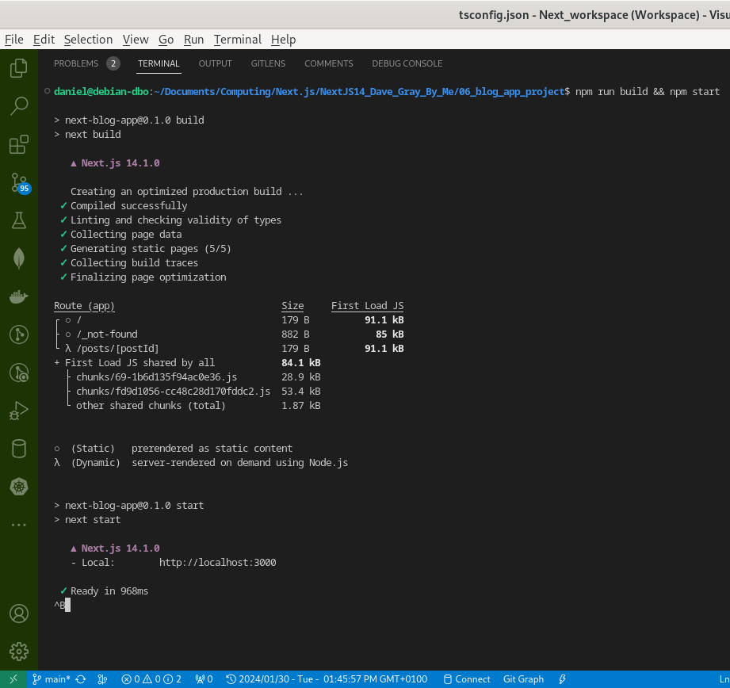
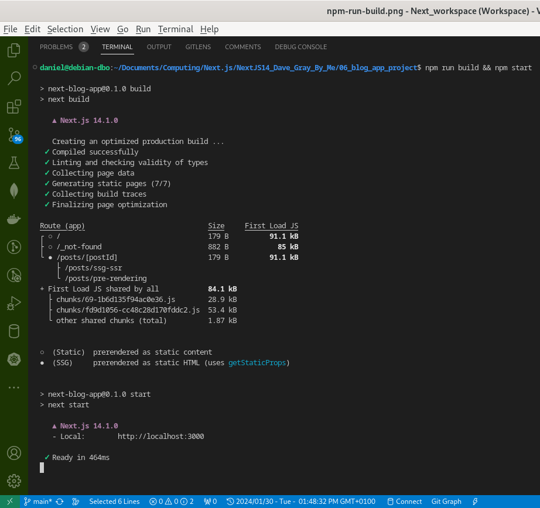

# Next.js Blog Website

##  (00:05) Welcome

- How to Build a Blog App with Nextjs 13 + Markdown files

##  (00:27) What We're Building

- build a blog using Next 14 + Markdown
- responsive  app
- tailwindCSS

##  (01:39) Basic Project Setup

- start anew project
- run : `npx create-next-app@latest next-blog-app`
- look up in hte project folder
- clean the main `page.tsx`, keep `<main></main>`
- delete `page/module.css` if any
- in `global.css` remove all but not tailwind directives if any

##  (03:39) TailwindCSS Setup & Typography

- install Tailwind if not yet, follow the instructions from their website for Next.js
- will generate html from markdown
- The @tailwindcss/typography plugin adds a set of prose classes that can be used to
  quickly add sensible typographic styles to content blocks that come from sources
  like markdown or a CMS database.

- Install the plugin from npm:
  `npm install -D @tailwindcss/typography`

- Then add the plugin to your tailwind.config.js file:

```ts
/** @type {import('tailwindcss').Config} */
module.exports = {
  theme: {
    // ...
  },
  plugins: [
    require('@tailwindcss/typography'),
    // ...
  ],
}
```

##  (08:17) Run in dev mode

- create `06_blog_app_project/components`
- add some tags in the main `page.jsx`

```tsx
import Posts from "./../components/Posts";

export default function Home() {
  return (
    <main className="px-6 mx-auto">
      <p className="mt-12 mb-12 text-3xl text-center dark:text-white">
        Hello and welcome ! &nbsp;
        <span className="whitespace-nowrap">
          I am <span className="font-bold">Daniel &#128526;</span>
        </span>
      </p>
      <Posts />
    </main>
  );
}
```

- update the main `layout.tsx`

```tsx
import "./globals.css";
import { Inter } from "next/font/google";
import type { Metadata } from "next";
import Navbar from "@/components/Navbar";
import ProfilePic from "@/components/ProfilePic";

const inter = Inter({ subsets: ["latin"] });

export const metadata: Metadata = {
  title: "Daniel's Blog",
  description:
    "Blog where I present my technical knowledge about web tools technologies, frontend, backend & databases. Powered by Daniel B. OUATTARA",
};

export default function RootLayout({
  children,
}: {
  children: React.ReactNode;
}) {
  return (
    <html lang="en">
      <body className="dark:bg-slate-800">
        <Navbar />
        <ProfilePic />
        {children}
      </body>
    </html>
  );
}
```

##  (10:05) Basic Navbar

- build the `Navbar`

##  (14:10) Profile Image

- add image to `/public/images/kangaroo_jack.jpg`
- create `ProfilePic.tsx` component as follow:

```tsx
import Image from "next/image";

export default function ProfilePic() {
  return (
    <section className="w-full mx-auto">
      <Image
        src={"/images/kangaroo_jack.jpg"}
        alt="Daniel Ouattara"
        width={200}
        height={200} 
        priority={true}
        className="border-2 border-black dark:border-slate-500 drop-shadow-xl shadow-black rounded-full mx-auto mt-8"
      />
    </section>
  );
}
```

##  (18:26) Adding Social Icons to the Navbar

-complete style for `Navbar`

- then add social links

```tsx
import Link from "next/link";
import { FaYoutube, FaTwitter, FaGithub, FaLaptop } from "react-icons/fa";

export default function Navbar() {
  return (
    <nav className="bg-slate-600 p-4 sticky top-0 drop-shadow-xl z-10">
      <div className="prose prose-xl mx-auto flex justify-between flex-col sm:flex-row">
        <h1 className="text-3xl font-bold text-white grid place-content-center mb-2 md:mb-0">
          <Link
            href="/"
            className="text-white/90 no-underline hover:text-white"
          >
            Daniel B. OUATTARA
          </Link>
        </h1>

        <div className="flex flex-row justify-center sm:justify-evenly align-middle gap-4 text-white text-4xl lg:text-5xl">
          <Link className="text-white/90 hover:text-white" href="#">
            <FaYoutube />
          </Link>

          <Link className="text-white/90 hover:text-white" href="#">
            <FaLaptop />
          </Link>

          <Link
            className="text-white/90 hover:text-white"
            href="https://github.com/danielOuattara"
          >
            <FaGithub />
          </Link>

          <Link className="text-white/90 hover:text-white" href="#">
            <FaTwitter />
          </Link>
        </div>
      </div>
    </nav>
  );
}

```

##  (21:42) Providing specific metadata

- done in `Layout.tsx`

##  (22:32) Adding Markdown files for Blog Posts

- create `06_blog_app_project/blogposts`
- add few markdown files there
- each file contains a `content` and a `front matter` metadata a bout the markdown file

##  (24:28) BlogPost type

- add types definition file `types.d.ts`

##  (25:13) Reading Markdown with gray-matter

- create `06_blog_app_project/libs` directory

```bash
libs
   ├── getFormattedDate.ts
   ├── getSinglePostData.ts
   ├── getSortedAllPostsFrontMatter.ts
   └── index.ts
```

- install `npm i gray-matter`

- `getSortedAllPostsFrontMatter`

```ts
import fs from "fs";
import path from "path";
import matter from "gray-matter";

const postsDirectory = path.join(process.cwd(), "blogposts");

export function getSortedAllPostsFrontMatter() {
  // Get file name under /posts
  const fileNames = fs.readdirSync(postsDirectory);

  const allPostsData = fileNames.map((fileName) => {
    // Remove .md from file name to get id/slug
    const id = fileName.replace(/\.md$/, "");

    // Read markdown file as string
    const fileFullPath = path.join(postsDirectory, fileName);
    const fileContent = fs.readFileSync(fileFullPath, "utf8");

    // Use gray-matter to parse the post metadata section
    const matterResult = matter(fileContent);

    const blogPost: TypeBlogPost = {
      id,
      title: matterResult.data.title,
      date: matterResult.data.date,
      description: matterResult.data.description,
    };

    // Combine the data with the id
    return blogPost;
  });

  // Sort posts by date
  return allPostsData.sort((a, b) => (a.date < b.date ? 1 : -1));
}

```

##  (29:23) Posts component

- `06_blog_app_project/components/Posts.tsx`

```tsx
import { getSortedAllPostsFrontMatter } from "@/libs";
import ListItem from "./ListItem";

export default function Posts() {
  const posts = getSortedAllPostsFrontMatter();

  return (
    <section className="mt-6 mx-auto max-w-2xl">
      <h2 className="text-4xl font-bold dark:text-white/90">Blogs List</h2>
      <ul className="w-full">
        {posts.map((post) => (
          <ListItem key={post.id} post={post} />
        ))}
      </ul>
    </section>
  );
}
```

- add `Posts.tsx` to the main `page.tsx`

##  (32:31) ListItem component Pt. 1

- create `06_blog_app_project/components/ListItem.tsx`

```tsx
import Link from "next/link";
import { getFormattedDate } from "@/libs";

type TypeProps = {
  post: TypeBlogPost;
};

export default function ListItem({ post }: TypeProps) {
  return (
    <li className="mt-4 text-2xl dark:text-white/90">
      <Link
        className="underline hover:text-black/70 dark:hover:text-white"
        href={`/posts/${post.id}`}
      >
        {post.title}
      </Link>
      <br />
      <p className="text-sm mt-1">{getFormattedDate(post.date)}</p>
    </li>
  );
}
```

##  (33:42) Formatting dates

- create `06_blog_app_project/libs/getFormattedDate.ts`

```tsx
export function getFormattedDate(dateString: string): string {
  return new Intl.DateTimeFormat("en-US", { dateStyle: "long" }).format(
    new Date(dateString),
  );
}
```

##  (34:56) ListItem component Pt. 2

- add `getFormattedDate()` to `LisItem.tsx`
- then same as previous

##  (37:28) Create a dynamic route

```bash
app
├── favicon.ico
├── globals.css
├── layout.tsx
├── page.tsx
└── posts
    └── [postId]
        ├── not-found.tsx
        └── page.tsx
```

##  (38:01) Dynamic Post Pt. 1

```tsx
import { notFound } from "next/navigation";
import Link from "next/link";
import {
  getFormattedDate,
  getSinglePostData,
  getSortedAllPostsFrontMatter,
} from "@/libs";

//---
type TypeProps = {
  params: {
    postId: string;
  };
};

//--------------------------------------------------------------
// this function SSR to SSG for all request for each blog
export function generateStaticParams() {
  const posts = getSortedAllPostsFrontMatter();
  return posts.map((post) => ({
    postId: post.id,
  }));
}

//--------------------------------------------------------------
export function generateMetadata({ params }: TypeProps) {
  const posts = getSortedAllPostsFrontMatter();
  const post = posts.find((post) => post.id === params.postId);

  if (!post) {
    return {
      title: "Post Not Found",
    };
  }

  return {
    title: post.title,
    description: post.description,
  };
}

//--------------------------------------------------------------
export default async function Post({ params }: TypeProps) {
  const posts = getSortedAllPostsFrontMatter();
  const post = posts.find((post) => post.id === params.postId);
  
  // check post exist !
  if (!post) {
    return notFound();
  }

  // get post data & render it
  const postData = await getSinglePostData(params.postId);

  return (
    <main className="px-6 prose prose-xl prose-slate dark:prose-invert mx-auto">
      <h1 className="text-3xl mt-4 mb-0">{postData.title}</h1>
      <p className="mt-0">{getFormattedDate(postData.date)}</p>
      <article>
        <section dangerouslySetInnerHTML={{ __html: postData.contentHtml }} />
        <p>
          <Link href="/">← Back to home</Link>
        </p>
      </article>
    </main>
  );
}
```

##  (40:45) Custom 404 page

- create ``06_blog_app_project/app/posts/[postId]/not-found.tsx`

```tsx
import Link from "next/link";

export default function NotFound() {
  return (
    <h1 className="m-5 text-center text-3xl">
      Sorry, The requested post does not exist.
      <br />
      <Link href={"/"} className="underline">
       ← Back to home
      </Link>
    </h1>
  );
}
```

## home

##  (41:04) Generate dynamic metadata

```tsx
export function generateMetadata({ params }: TypeProps) {
  const posts = getSortedAllPostsFrontMatter();
  const post = posts.find((post) => post.id === params.postId);

  if (!post) {
    return {
      title: "Post Not Found",
    };
  }

  return {
    title: post.title,
    description: post.description,
  };
}
```

- go to [(38:01) Dynamic Post Pt. 1](#3801-dynamic-post-pt-1) for more.

##  (42:54) Generate HTML from Markdown

- install `npm i remark remark-html`

- `06_blog_app_project/libs/getSinglePostData.ts`

```tsx
import fs from "fs";
import path from "path";
import matter from "gray-matter";
import { remark } from "remark";
import html from "remark-html";

const postsDirectory = path.join(process.cwd(), "blogposts");

export async function getSinglePostData(id: string) {
  const fileFullPath = path.join(postsDirectory, `${id}.md`);

  const fileContents = fs.readFileSync(fileFullPath, "utf8");

  // Use gray-matter to parse the post metadata section
  const matterResult = matter(fileContents);

  const processedContent = await remark()
    .use(html)
    .process(matterResult.content);

  const contentHtml = processedContent.toString();

  const blogPostWithHTML: TypeBlogPost & { contentHtml: string } = {
    id,
    title: matterResult.data.title,
    date: matterResult.data.date,
    description: matterResult.data.description,
    contentHtml,
  };

  // Combine the data with the id
  return blogPostWithHTML;
}
```

##  (46:29) Dynamic Post Pt. 2

- add `getSinglePostData` to the mix

```tsx
...
  // get post data & render it
  const postData = await getSinglePostData(params.postId);
...
```

- go to [(38:01) Dynamic Post Pt. 1](#3801-dynamic-post-pt-1) and look in the `Post.tsx` component

##  (48:37) Evaluating the Project Build

- `npm run build`
  
- analyze the build, and look the image
  

  
- `npm run start`

##  (51:08) Improving the build with generateStaticParams

```tsx
//--------------------------------------------------------------
// this function SSR to SSG for all request for each blog
export function generateStaticParams() {
  const posts = getSortedAllPostsFrontMatter();
  return posts.map((post) => ({
    postId: post.id,
  }));
}

//--------------------------------------------------------------
export function generateMetadata({ params }: TypeProps) {...}

//--------------------------------------------------------------
export default async function Post({ params }: TypeProps) {...}
```

- go to [(38:01) Dynamic Post Pt. 1](#3801-dynamic-post-pt-1)
  and look in the `Post.tsx` component

- `npm run build`
  
- analyze the build, and look the image
  


- `npm run start` to check

##  (53:37) Features You Can Add

- to add a new blog, just create a markdown and follow the structure
  of other markdown files present in the `06_blog_app_project/blogposts`
  folder

- create a search filter by blog name or date

- extra SEO info for each blog, see the Next.js docs
