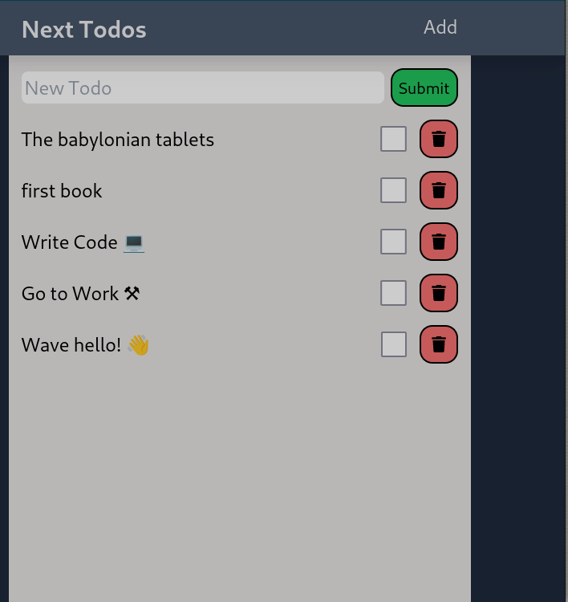

# Mutating Data in Next.js | Mutations with Nextjs 13

##  (00:26) Lesson Plan

- mutating data
- todo list
- how Next.js handle the data mutation from our CRUD operation
- how Next.js handle hard and soft navigation and what the difference is
- understanding concepts

##  (01:02) Important Note

- refer to official docs for continuous updates about data mutation
- (<https://nextjs.org/docs/app/building-your-application/data-fetching/server-actions-and-mutations>)

##  (01:27) Two ways to see immediate updates

- describing Next.js todo list application
- a Server Component (plus interface)`<Todos />` to fetch a list of todos
- note `{cache: 'no-store}` as options added to `fetch()` method
- this option allows for immediate update in Next.js (version 14)
- other  technic to see immediate update is to  use a `revalidatePath()` or `revalidateTags()`

##  (02:34) Reviewing the components

- so the `<Todos />`  fetches the list of todos and then render a list
  of todos
- then those todos data are passed as prop to simple `<Todo />`
- this `<Todo />` is a `use client` component to allow interactivity: `update` and `delete`
- here they use `useRouter, useTransition, useState`

##  (04:26) router.refresh()

- `startTransition` to handle `router.refresh()` so get data updated visible

##  (05:01) Reviewing the app in VS Code

- main `/src/app/page.tsx`

```tsx
import TodoList from "./../components/TodoList";
import AddTodo from "./../components/AddTodo";

export const revalidate = 0;

export default function Home() {
  return (
    <>
      <AddTodo />
      <TodoList />
    </>
  );
}
```

- `/src/lib/fetchTodos.ts`

```ts
export default async function fetchTodos() {
  const res = await fetch(`http://127.0.0.1:3500/todos`);
  const todos: Todo[] = await res.json();
  return todos;
}
```

- `src/components/TodoList.tsx`

```ts
import Todo from "./Todo";
import fetchTodos from "@/lib/fetchTodos";

export default async function TodoList() {
  const todos = await fetchTodos();
  const sortedTodos = todos.reverse();

  return (
    <>
      {sortedTodos.map((todo) => (
        <Todo key={todo.id} {...todo} />
      ))}
    </>
  );
}
```

- `src/components/Todo.tsx`

```tsx
"use client";

import { FaTrash } from "react-icons/fa";
import { useRouter } from "next/navigation";
import { useState, useTransition, ChangeEvent, MouseEvent } from "react";
import Link from "next/link";

export default function Todo(todo: Todo) {
  const router = useRouter();
  const [isPending, startTransition] = useTransition();
  const [isFetching, setIsFetching] = useState(false);

  const isMutating = isFetching || isPending;

  const handleChange = async (e: ChangeEvent<HTMLInputElement>) => {
    e.preventDefault(); // useful ?
    setIsFetching(true);

    const res = await fetch(`http://127.0.0.1:3500/todos/${todo.id}`, {
      method: "PUT",
      headers: {
        "Content-Type": "application/json",
      },
      body: JSON.stringify({
        ...todo,
        completed: !todo.completed,
      }),
    });

    await res.json();

    setIsFetching(false);

    startTransition(() => {
      // Refresh the current route and fetch new data
      // from the server without losing
      // client-side browser or React state.
      router.refresh();
    });
  };

  const handleDelete = async (e: MouseEvent<HTMLButtonElement>) => {
    e.preventDefault(); // useful ?
    setIsFetching(true);

    const res = await fetch(`http://127.0.0.1:3500/todos/${todo.id}`, {
      method: "DELETE",
      headers: {
        "Content-Type": "application/json",
      },
      body: JSON.stringify({
        id: todo.id,
      }),
    });

    await res.json();

    setIsFetching(false);

    startTransition(() => {
      // Refresh the current route and fetch new data
      // from the server without losing
      // client-side browser or React state.
      router.refresh();
    });
  };

  return (
    <article
      className="my-4 flex justify-between items-center"
      style={{ opacity: !isMutating ? 1 : 0.7 }}
    >
      <label className="text-2xl hover:underline">
        <Link href={`/edit/${todo.id}`}>{todo.title}</Link>
      </label>
      <div className="flex items-center gap-4">
        <input
          type="checkbox"
          checked={todo.completed}
          id="completed"
          name="completed"
          onChange={handleChange}
          disabled={isPending}
          className="min-w-[2rem] min-h-[2rem]"
        />

        <button
          onClick={handleDelete}
          disabled={isPending}
          className="p-3 text-xl rounded-2xl text-black border-solid border-black border-2 max-w-xs bg-red-400 hover:cursor-pointer hover:bg-red-300"
        >
          <FaTrash />
        </button>
      </div>
    </article>
  );
}
```

- `/src/app/add/page.tsx`

```tsx
import AddTodo from "@/components/AddTodo";

export default function page() {
  return <AddTodo />;
}

```

- `/src/app/edit/[id]/page.tsx`

```tsx
import Todo from "@/components/Todo";
import fetchTodo from "@/lib/fetchTodo";
import { notFound } from "next/navigation";

export const revalidate = 0;

type Props = {
  params: {
    id: string;
  };
};

export default async function page({ params }: Props) {
  const todo = await fetchTodo(params.id);

  if (!todo) notFound();

  return <Todo {...todo} />;
}

```

##  (08:05) Running the app & JSON-Server

- on one terminal, run the local data server: `npx json-server -w db.json -p 3500 -h 127.0.0.1`
- on another terminal run  `npm run dev`
- go to `http://localhost:3000` to see the list of todos



- quick testing:
  - add a new todo and watch what happen on the UI: confirm `shading and immediate update`
  - delete a todo and watch what happen on the UI: confirm `shading and immediate update`

**Notice**:  You can add a todo by 2 ways:

 1. directly on the input field
 2. by navigating to the `Add page` using the `Add button`

##  (09:47) Identifying a BIG Problems

1. todo list is not updated:
   - one can add a new todo by going to the `Add page`
   - adding seems to work and user is redirected to the main `Page`
   - **problem :** the newly added todo is not listed after redirecting to home page

2. update on a single todo page is not reflected home page
   - navigate to a singe todo page
   - update a single todo (done / no done)
   - navigate back to home
   - **problem :** update is not reflected to home page
  
- when on the same page and call `router.refresh()` every thing goes well
- when on different pages and call `router.refresh()` data are not refreshed

##  (13:44) Setting prefetch to false

- solution:

```tsx
import Link from "next/link";

export default function Navbar() {
  return (
    <nav className="bg-slate-600 p-4 sticky top-0 drop-shadow-xl z-10">
      <div className="max-w-xl mx-auto sm:px-4 flex justify-between">
        <h1 className="text-3xl font-bold mb-0">
          <Link
            prefetch={false} // <--- HERE
            href="/"
            className="text-white/90 no-underline hover:text-white"
          >
            Next Todos
          </Link>
        </h1>

        <Link
          href="/add"
          className="text-2xl text-white/90 no-underline hover:text-white"
        >
          Add
        </Link>
      </div>
    </nav>
  );
}

```

##  (15:12) Hard navigation vs Soft navigation

**Understanding the difference between hard navigation and soft navigation in Next.js can help you manage state and data updates more effectively.**

###  Hard Navigation vs. Soft Navigation

**Hard Navigation:**

This is when the entire page is refreshed, similar
to how traditional websites work. When you perform a hard navigation,
the browser reloads the current page, and Next.js will fetch and render
the page from scratch. This ensures that all data is re-fetched and
re-rendered, reflecting any changes made to the data.

**Soft Navigation:**

This is when navigation is handled client-side, without a full page
reload. In Next.js, this is typically done using the `Link` component
or programmatically with the `router.push` method.
Soft navigation preserves the state of the application and provides a
smoother user experience, but it may not always trigger data re-fetching
less explicitly handled.

**When to Use Hard Navigation**:

Hard navigation is useful when you need to ensure that the latest data is
always fetched and rendered. This is particularly relevant in cases where
the application state needs to be reset or when critical updates have
occurred that require a fresh fetch of data.

**When to Use Soft Navigation**:

Soft navigation is ideal for maintaining application state and providing a
smoother user experience. It should be used when the data consistency can
be managed through client-side state updates or when the data changes are
less critical.

### Implementing Hard Navigation in Next.js

To implement hard navigation, you can use the `window.location` object to force a full page reload.

### Implementing Soft Navigation with Data Re-fetching

To implement soft navigation with data re-fetching, you can use Next.js'
`router.refresh()` method after making changes to ensure the latest data is
fetched without a full page reload:

understanding and using hard and soft navigation efficiently can indeed help you
reduce the need for useEffect for data fetching in certain scenarios.

However, it's important to understand when and why you might use each approach.

**Using Hard Navigation**:

Hard navigation ensures that the entire page is reloaded, and thus, all data fetching
logic defined in the initial load of the page is executed again. This guarantees that
the data displayed on the page is always up-to-date.

**Using Soft Navigation with Client-side Data Refreshing**:

Soft navigation can be used in combination with client-side data refreshing methods,
like router.refresh(), to update the page data without a full reload. This approach
maintains a smoother user experience while ensuring data consistency.

##  (16:14) Is prefetch the right solution?

##  (18:35) A Better Solution is almost here
